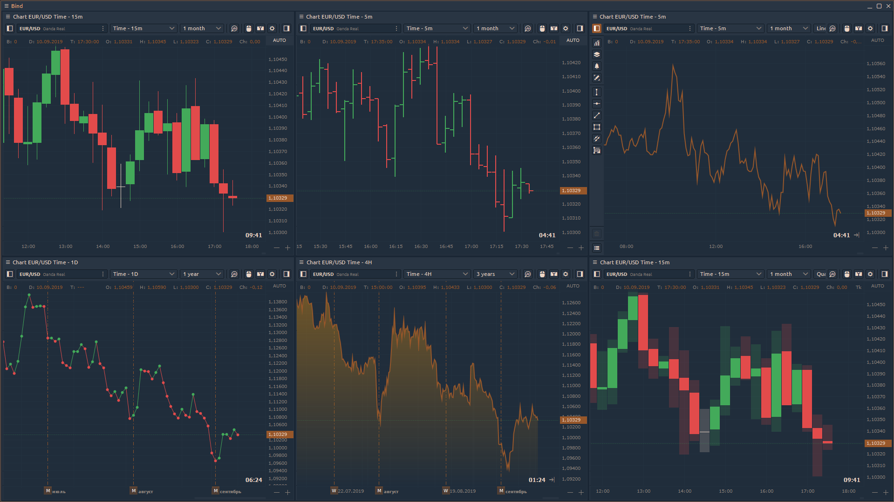

# Chart types

OptimusFLOW offers a variety of chart types to help you display chart data in different formats. You can change chart type from _**Aggregation type**_ menu as shown below.

## Chart types and styles

OptimusFLOW provides **9 chart types**:

* Tick chart
* [Time chart](https://help.optimusflow.qtower.app/analytics-panels/chart/chart-types/time-aggregation)
* [Heiken-Ashi](https://help.optimusflow.qtower.app/analytics-panels/chart/chart-types/heiken-ashi)
* [Range Bars](https://help.optimusflow.qtower.app/analytics-panels/chart/chart-types/range-bars)
* [Renko](https://help.optimusflow.qtower.app/analytics-panels/chart/chart-types/renko)
* [Line Break](https://help.optimusflow.qtower.app/analytics-panels/chart/chart-types/line-break)
* [Kagi](https://help.optimusflow.qtower.app/analytics-panels/chart/chart-types/kagi)
* [Points & Figures](https://help.optimusflow.qtower.app/analytics-panels/chart/chart-types/points-and-figures)
* [Volume](volume-bars.md)

Charts can also be represented in **6 different styles**:

* Candle
* Bar
* Line
* Dotted Line
* Area
* OptimusFLOW

