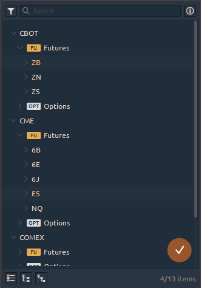

# Symbols lookup

Symbols lookup manager — is a special screen, allowing to search and select any available symbol from active connections. There are various panels in OptimusFLOW terminal, that require to have a Symbol parameter being set up \(Watchlist, Chart, Symbol info etc.\). Depending on the requirements, symbols lookup can allow single or multiple symbols selection.

Each time you successfully connect with some integration, you will get a list of its symbols in Symbol lookup manager screen. Due to OptimusFLOW allows a multiple integrations connection, you may have several similar symbols with data, that can vary a bit. This is normal because different providers can give us different quotes data.

## Lookup field

Symbols lookup screen usually invoked from a lookup field. This field consists of two parts that allow you to open lookup screen:

* Symbol name \(with connection name\)
* “_**Lookup**_” icon in the form of three vertical points

If you click on symbol name you will see that Lookup screen will pop up and the symbols, entered by you will be applied as filtering for the Symbols list.

If you click on “_**Lookup**_” icon you will see the popped up Lookup screen without any filtering applied to symbols list.

Anyway, you will get the Lookup screen, ready for Symbol selection. Lookup screen consists of three elements:

* Toolbar with Search field and filter
* The list of Connections and their symbols
* Footer section

If you want to close it just click outside of it.

## Searching & Filtering

Usually, each connection gives you a numerous list of trading Symbols to select from. If you know name, you can start typing it in “_**Search field**_”, and the below list will be instantly filtered to the items, containing the entered phrase.

In the example below, we search for ES:


Be careful. While the Search field becomes reset each Lookup screen invoke, the second level filters stay as they were set up last time. So if you can’t find the required Symbol type — please check if you have this type enabled.


## Symbols list

The list of symbols is a result of filtering in Lookup screen. Here you can see the nested tree of Symbols, grouped in the following order:

* Connection
* Exchange
* Type
* Subtypes

The Symbol types are marked with additional icons to help you identify the required one more quickly. The Symbol item row consists of Name and description.

To select the Symbol — click on it; to apply the symbol to the required panel, just double-click on it. This action closes the Lookup screen

## Multiple Symbols Select

In some cases, when panel can accept more than one Symbol item from lookup \(like the Watchlist\), you have an ability to select multiple items by holding the "_**Ctrl key**_" and clicking on the list. Once you ready to apply multiple items — press the "_**check icon**_" in the right bottom corner of the list. You may also select any category level item to apply all its contents to the required panel.

## List footer

To help you deal with the big lists of Symbols, there is a footer toolbar with a set of mass actions. It allows to:

* Collapse all nodes
* Expand head nodes \(top-level nodes, usually Connections\)
* Expand first-level child nodes

The other useful information is placed on the right side of footer toolbar — items count. It may show the total amount of available Symbols \(after the filtering was applied\) as well as 3/235 \(3 from 235\) value, saying that you have selected multiple items among available.

